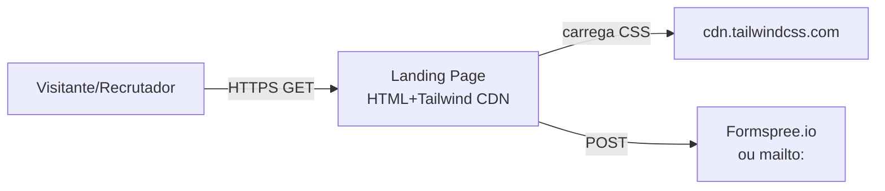

# Architecture - Personal Portfolio Landing Page

## C4 Level 1 - Context



## Decisoes Arquiteturais

| Decisao | Escolha | Justificativa |
|---------|---------|---------------|
| Hosting | GitHub Pages | Gratuito, HTTPS, CDN global |
| Framework | Nenhum (vanilla) | Single file, zero build |
| CSS | Tailwind CDN | Sem build, customizavel via config inline |
| Interatividade | Vanilla JS minimo | Toggles, smooth scroll |
| Form | mailto: ou Formspree | Zero backend, gratuito |
| Fontes | System fonts (Inter) | Sem network requests |
| Imagens | `` otimizado | `loading=lazy`, `decoding=async` |

## Anti-patterns evitados

- jQuery (vanilla JS resolve)
- Build pipeline (Tailwind CDN)
- SPA framework (1 pagina estatica)
- CSS-in-JS (Tailwind utility classes)
- Web fonts pesados (system fonts)

## Estrutura de arquivos

```
/
├── index.html         (pagina principal, 1-3KB inline)
├── README.md          (instrucoes de deploy)
└── .gitignore         (ignora OS files)
```
