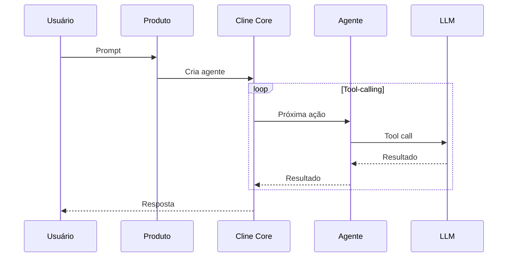

# Cline — Arquitetura

## Visão Geral

Cline é um monorepo npm workspaces com produtos compartilhando o mesmo core. A arquitetura é centrada em SDK que alimenta CLI, VS Code, JetBrains e Kanban.

## Estrutura de Diretórios

```
apps/
  cli/              # CLI interface
  vscode/           # VS Code extension
  webview-ui/       # Webview UI components
  testing-platform/ # Testing platform
sdk/
  packages/         # SDK packages
  src/              # SDK source
src/
  extension.ts      # Entry point da extensão
  ClineProvider.ts  # Provider principal
  core/
    agent-loop.ts   # Loop de agente
    context.ts      # Montagem de contexto
    tools.ts        # Sistema de ferramentas
  services/
    mcp.ts          # Cliente MCP
    checkpoint.ts   # Checkpoint/restore
docs/
evals/
```

## Produtos

| Produto | Local | Descrição |
|---------|-------|-----------|
| SDK | `sdk/` | API Node.js para agentes programáticos |
| CLI | `apps/cli/` | Terminal UI, headless mode |
| VS Code | `apps/vscode/` | Extensão Marketplace |
| JetBrains | fechado | Plugin IntelliJ/PyCharm/WebStorm |
| Kanban | `cline/kanban` | Multi-agent task board |

## Fluxo de Ativação



## Componentes Principais

| Componente | Arquivo | Responsabilidade |
|------------|---------|------------------|
| ClineProvider | `src/ClineProvider.ts` | Entry point da extensão |
| AgentLoop | `src/core/agent-loop.ts` | Loop de tool-calling |
| ContextAssembler | `src/core/context.ts` | Monta contexto |
| ToolExecutor | `src/core/tools.ts` | Executa ferramentas |
| MCPClient | `src/services/mcp.ts` | Cliente MCP |
| CheckpointManager | `src/services/checkpoint.ts` | Save/restore |

## Dependências Externas

| Dependência | Uso |
|-------------|-----|
| TypeScript | Linguagem |
| VS Code API | Extensão |
| MCP SDK | Servidores MCP |
| Playwright | Browser automation |

## Padrões Arquiteturais

1. **Shared Core** — Mesmo core para CLI, VS Code, JetBrains, Kanban
2. **SDK Programático** — API para criar agentes customizados
3. **Plugin System** — Registro de tools e hooks via SDK
4. **Checkpoint** — Estado completo serializado para retomada

## Pontos Fortes

1. Produtos compartilham core
2. SDK programático extensível
3. Checkpoint/restore confiável
4. Multi-plataforma

## Limitações

1. JetBrains não é open-source
2. Sem compactação de contexto
3. Sem memória entre sessões
4. Sem per-directory rules

## Oportunidades para o XForge

1. Shared core é excelente modelo
2. Checkpoint com estado completo
3. SDK programático para extensibilidade