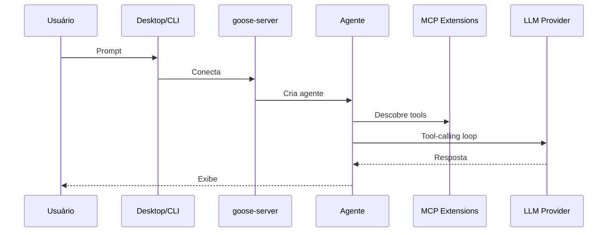

# Goose — Arquitetura

## Visão Geral

Goose é um projeto Rust com estrutura de crates. A arquitetura é MCP-first com 70+ extensões e 15+ provedores LLM.

## Estrutura de Diretórios (Rust Crates)

```
crates/
  goose/              # Core logic — agente, tools, providers
  goose-cli/          # CLI entry point
  goose-server/       # Backend server (binary: goosed)
  goose-mcp/          # Extensões MCP (70+ servidores)
  goose-acp-macros/   # Proc  goose-test/         # Utilitários de teste
  goose-test-support/ # Suporte a testes
ui/
  desktop/            # Electron desktop app
  text/               # Terminal UI
evals/
  open-model-gym/     # Benchmarking
services/             # Serviços externos
```

## Componentes Principais

| Crate | Responsabilidade |
|-------|------------------|
| goose | Core do agente, tools, providers |
| goose-cli | Entry point CLI |
| goose-server | Backend HTTP server |
| goose-mcp | Cliente e servidores MCP |

## Fluxo de Ativação



## Dependências Externas

| Dependência | Uso |
|-------------|-----|
| Rust | Linguagem |
| Tokio | Async runtime |
| MCP SDK | Protocolo MCP |
| Electron | Desktop app |

## Padrões Arquiteturais

1. **MCP-first** — Arquitetura centrada em extensões MCP
2. **Rust Crates** — Modularidade via crate system
3. **Multi-provider** — 15+ provedores LLM
4. **Desktop + CLI + API** — Múltiplas interfaces

## Pontos Fortes

1. Rust performance
2. MCP-first architecture
3. 70+ extensões
4. Multi-plataforma

## Limitações

1. Sem multi-agentes
2. Sem compactação
3. Sem memória entre sessões

## Oportunidades para o XForge

1. MCP-first é modelo excelente
2. Rust performance pode inspirar