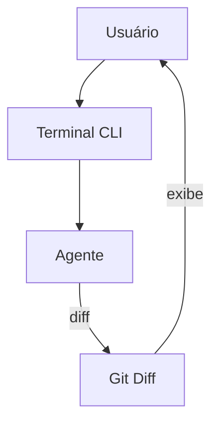

# Aider — Sistema de Chat

## Arquitetura

O Aider não tem chat — é um CLI de terminal:

## Componentes

| Componente | Arquivo | Descrição |
|------------|---------|-----------|
| Terminal UI | `aider/io.py` | Interface de terminal |
| Edit Loop | `aider/main.py` | Loop de edição |
| Git Diff | `aider/utils.py` | Gera diffs |

## Funcionalidades

1. **Terminal-only** — Sem GUI
2. **Git Diff** — Mostra mudanças como diff
3. **Auto-commit** — Commits automáticos
4. **Pair Programming** — Colaboração no terminal

## Stack

| Tecnologia | Versão |
|------------|--------|
| Python | 3.10+ |
| Rich (TUI) | latest |

## Pontos Fortes

1. Minimalista
2. Git-native

## Limitações

1. Sem GUI
2. Sem streaming
3. Sem multi-sessão