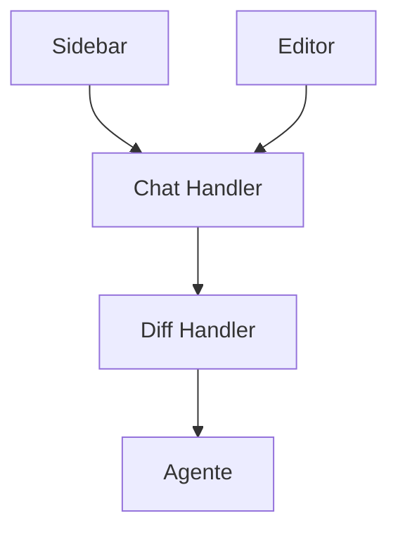

# Cline — Sistema de Chat

## Arquitetura

O chat do Cline é implementado em `apps/vscode/webview-ui/` com React:

## Componentes

| Componente | Arquivo | Descrição |
|------------|---------|-----------|
| Chat Webview | `apps/vscode/webview-ui/` | Interface de chat |
| Diff View | `src/components/diff/` | Preview de mudanças |
| Message Handler | `src/chat/handler.ts` | Processa mensagens |

## Funcionalidades

1. **Diff Review** — Cada mudança mostrada como diff antes de aplicar
2. **Human-in-the-loop** — Aprovação de cada ação
3. **Plan/Act Toggle** — Alterna entre planejar e executar
4. **Browser Preview** — Preview de páginas web
5. **Checkpoint** — Save/restore de estado

## Ações de Diff

| Ação | Descrição |
|------|-----------|
| Accept | Aplica mudança |
| Reject | Rejeita mudança |
| Modify | Modifica antes de aplicar |

## Stack

| Tecnologia | Versão |
|------------|--------|
| React | latest |
| TypeScript | 5.x |

## Pontos Fortes

1. Diff review integrado
2. Human-in-the-loop
3. Browser preview

## Limitações

1. Sem streaming (respostas completas)
2. Sem multi-sessão