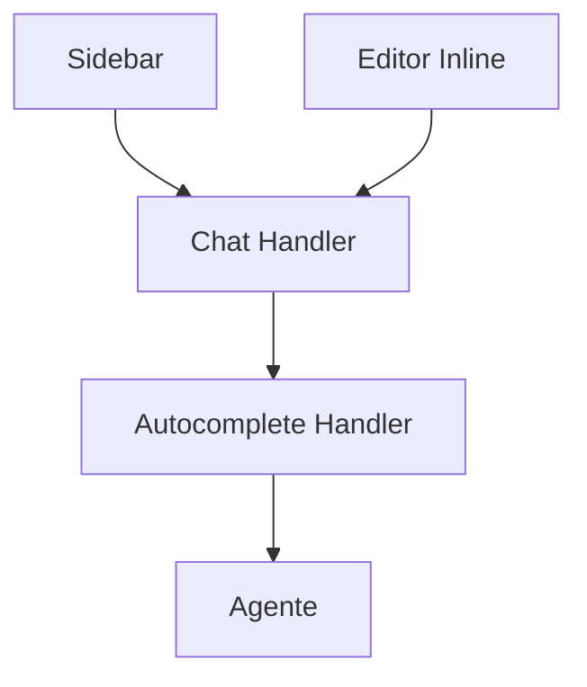

# Continue — Sistema de Chat

## Arquitetura

O chat do Continue é implementado em `packages/gui/` com React:

## Componentes

| Componente | Package | Descrição |
|------------|---------|-----------|
| Chat GUI | `packages/gui/` | Interface de chat |
| Autocomplete | `packages/core/` | Sugestões inline |
| Message Handler | `packages/core/` | Processa mensagens |

## Funcionalidades

1. **@context Chat** — Referência a arquivos/pastas no chat
2. **Inline Autocomplete** — Sugestões ghost-text
3. **Chat History** — Histórico de conversas
4. **Multi-IDE** — Mesma experiência no VS Code e JetBrains

## @context no Chat

| Comando | Ação |
|---------|------|
| `@file src/main.ts` | Inclui arquivo no contexto |
| `@folder src/` | Inclui pasta no contexto |
| `@codebase` | Inclui estrutura completa |
| `@docs` | Inclui documentação |

## Stack

| Tecnologia | Versão |
|------------|--------|
| React | latest |
| TypeScript | 5.x |

## Pontos Fortes

1. @context system único
2. Inline autocomplete
3. Multi-IDE

## Limitações

1. Read-only (não mantido)
2. Sem streaming