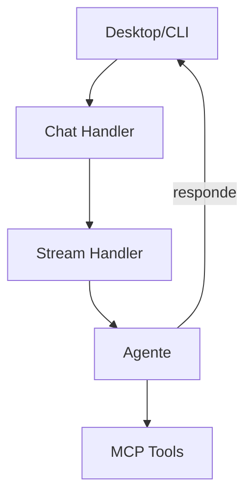

# Goose — Sistema de Chat

## Arquitetura

O chat do Goose é implementado em `ui/desktop/` (Electron) e `ui/text/` (TUI):

## Componentes

| Componente | Local | Descrição |
|------------|-------|-----------|
| Desktop Chat | `ui/desktop/src/` | Interface Electron |
| TUI Chat | `ui/text/` | Interface terminal |
| Stream Handler | `crates/goose-server/` | Streaming |

## Funcionalidades

1. **Desktop App** — Interface Electron completa
2. **Terminal TUI** — Interface de terminal
3. **System Tray** — Sempre acessível
4. **Streaming** — Respostas em tempo real
5. **Multi-provider** — 15+ provedores LLM

## Stack

| Tecnologia | Versão |
|------------|--------|
| Electron | latest |
| React | latest |
| Rust (backend) | latest |

## Pontos Fortes

1. Desktop + CLI + API
2. System tray
3. Multi-plataforma

## Limitações

1. Sem diff review
2. Sem multi-sessão