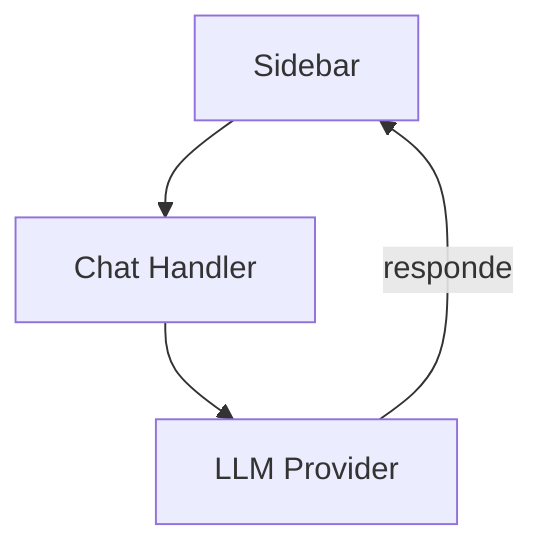

# MiMo-Code — Sistema de Chat

## Arquitetura

O chat do MiMo-Code é minimalista:

## Componentes

| Componente | Responsabilidade |
|------------|------------------|
| Chat Webview | Interface de chat |
| LLM Client | Cliente LLM |

## Funcionalidades

1. **Simples** — Chat básico
2. **Multi-provedor** — Suporte a vários LLMs

## Stack

| Tecnologia | Versão |
|------------|--------|
| TypeScript | 5.x |

## Pontos Fortes

1. Leve
2. Simples

## Limitações

1. Funcionalidades limitadas
2. Sem MCP