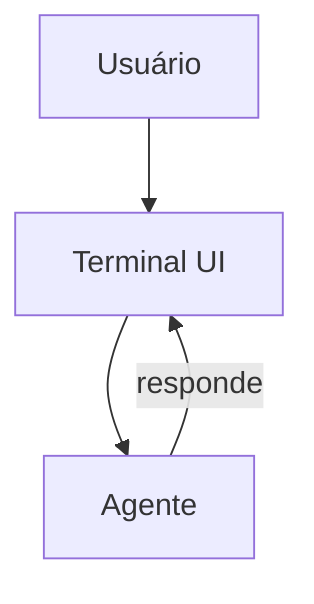

# OpenCode — Sistema de Chat

## Arquitetura

O OpenCode tem TUI (Terminal UI):

## Componentes

| Componente | Arquivo | Descrição |
|------------|---------|-----------|
| TUI | `internal/tui/` | Terminal UI |
| Commands | `cmd/` | Comandos CLI |

## Funcionalidades

1. **TUI** — Interface de terminal
2. **Single-binary** — Instalação simples
3. **Multi-provedor** — Suporte a vários LLMs

## Stack

| Tecnologia | Versão |
|------------|--------|
| TypeScript | 5.x |
| Node.js | latest |

## Pontos Fortes

1. TUI minimalista
2. Single-binary

## Limitações

1. Sem GUI rica
2. Sem streaming
3. Sem MCP