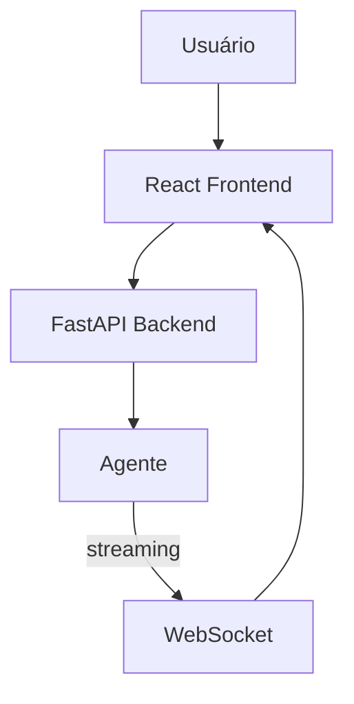

# OpenHands — Sistema de Chat

## Arquitetura

O OpenHands tem interface web:

## Componentes

| Componente | Local | Descrição |
|------------|-------|-----------|
| Frontend | `frontend/` | React app |
| Backend API | `openhands/` | FastAPI |
| WebSocket | `openhands/` | Streaming |

## Funcionalidades

1. **Web UI** — Interface web completa
2. **Streaming** — Respostas em tempo real via WebSocket
3. **Sandbox Output** — Output do sandbox em tempo real
4. **Event Log** — Log de eventos do agente

## Stack

| Tecnologia | Versão |
|------------|--------|
| React | latest |
| FastAPI | latest |
| WebSocket | latest |

## Pontos Fortes

1. Web UI acessível
2. Streaming via WebSocket
3. Sandbox output em tempo real

## Limitações

1. Latência do sandbox
2. Sem diff review