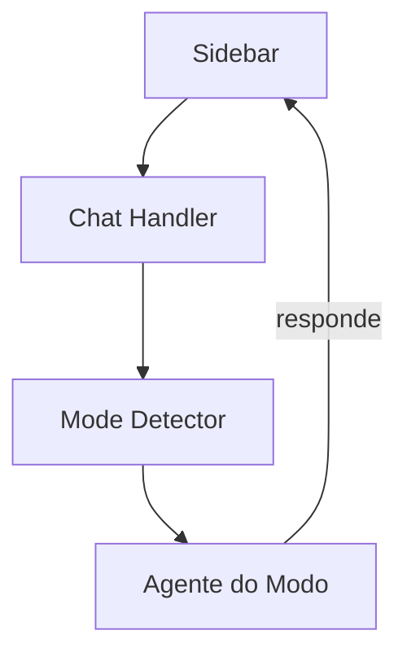

# Roo-Code — Sistema de Chat

## Arquitetura

O chat do Roo-Code é implementado em `webview-ui/`:

## Componentes

| Componente | Local | Descrição |
|------------|-------|-----------|
| Chat Webview | `webview-ui/src/` | Interface de chat |
| Mode Detector | `src/modes/` | Detecta modo do chat |
| Message Handler | `src/chat/` | Processa mensagens |

## Funcionalidades

1. **Mode-based Chat** — Comportamento especializado por modo
2. **Mode Selector** — Seletor de modo no chat
3. **Custom Modes** — Modos personalizáveis
4. **MCP Tools** — Ferramentas externas no chat

## Stack

| Tecnologia | Versão |
|------------|--------|
| React | latest |
| TypeScript | 5.x |

## Pontos Fortes

1. Mode-based chat
2. Custom modes

## Limitações

1. Descontinuado
2. Sem streaming