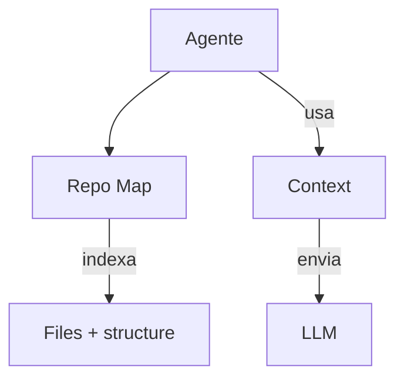

# Aider — Gerenciamento de Contexto

## Arquitetura

O Aider usa repo mapping para contexto:

## Componentes

| Componente | Arquivo | Responsabilidade |
|------------|---------|------------------|
| RepoMap | `aider/repomap.py` | Mapeamento do repositório |
| Context Builder | `aider/main.py` | Monta contexto |

## Repo Mapping

O RepoMap é uma funcionalidade única:
- Indexa estrutura do projeto automaticamente
- Entende relações entre arquivos
- Gera contexto relevante para o LLM
- Atualizado a cada mudança

## Git Context

O Aider inclui contexto git:
- Commits recentes
- Diffs
- Branch info

## Pontos Fortes

1. Repo mapping automático
2. Git context integrado

## Limitações

1. Sem RAG
2. Sem compaction
3. Sem per-directory rules

## Oportunidades para o XForge

1. Repo mapping + RAG = contexto superior