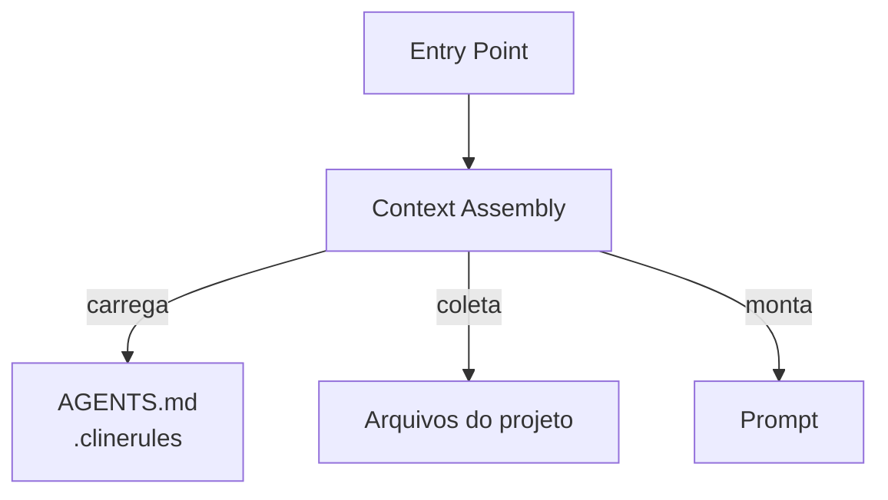

# Cline — Gerenciamento de Contexto

## Arquitetura

O contexto no Cline é simples e direto:

## Componentes

| Componente | Arquivo | Responsabilidade |
|------------|---------|------------------|
| ContextAssembler | `src/core/context.ts` | Monta contexto |
| CheckpointManager | `src/services/checkpoint.ts` | Save/restore |

## Context Assembly

1. System prompt (fixo)
2. Tool definitions (fixo)
3. .clinerules (regras do projeto)
4. Estrutura do projeto (repo map)
5. Histórico de mensagens

## Checkpoint System

O Cline salva checkpoints completos:
- Estado da conversação
- Arquivos modificados
- Próximos passos
- Decisões tomadas

## Pontos Fortes

1. Checkpoint completo
2. .clinerules por projeto

## Limitações

1. Sem compactação
2. Sem RAG
3. Sem per-directory rules

## Oportunidades para o XForge

1. Checkpoint com estado completo
2. .clinerules como modelo para per-directory