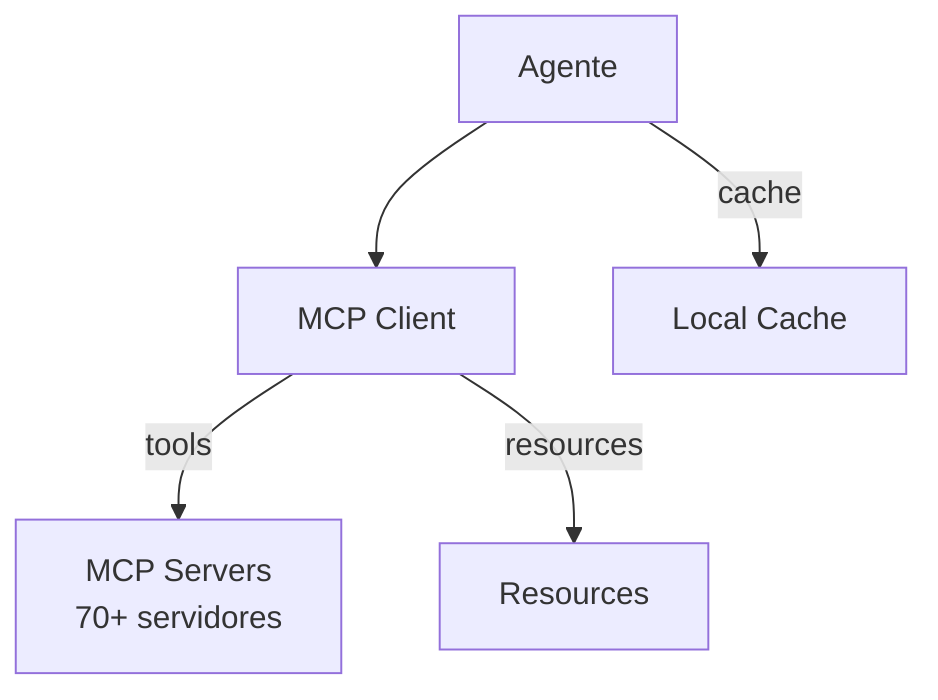

# Goose — Gerenciamento de Contexto

## Arquitetura

O Goose usa MCP para contexto externo:

## Componentes

| Componente | Crate | Responsabilidade |
|------------|-------|------------------|
| MCP Client | goose-mcp | Conecta a servidores |
| Context Builder | goose | Monta contexto |
| Cache | goose | Cache local |

## MCP como Contexto

O Goose é único: o contexto vem principalmente dos MCP servers:
- 70+ servidores MCP
- Tools descobertos dinamicamente
- Resources (arquivos, dados) via MCP

## Pontos Fortes

1. MCP-first context
2. 70+ fontes de contexto
3. Cache local

## Limitações

1. Sem RAG local
2. Sem compaction
3. Depende de MCP servers

## Oportunidades para o XForge

1. MCP como fonte de contexto
2. Cache de recursos MCP