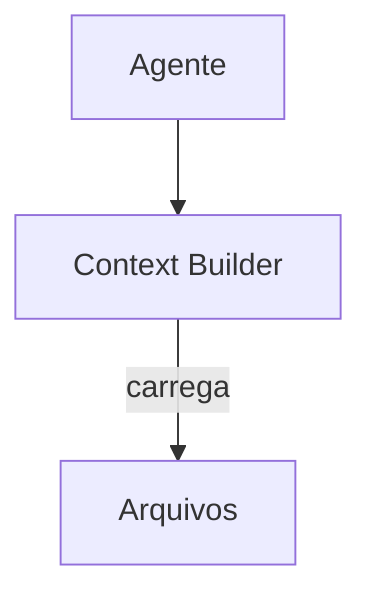

# OpenCode — Gerenciamento de Contexto

## Arquitetura

O OpenCode tem contexto mínimo:

```mermaid
flowchart TD
    AG[Agente] --> CTX[Context Builder]
    CTX -->|carrega| FILES[Arquivos]
```

## Pontos Fortes

1. Minimalista
2. Rápido

## Limitações

1. Funcionalidades limitadas
2. Sem RAG