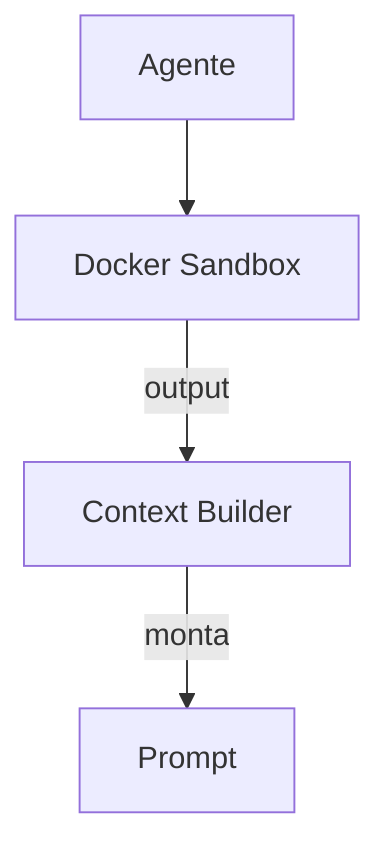

# OpenHands — Gerenciamento de Contexto

## Arquitetura

O OpenHands usa sandbox para contexto:

## Componentes

| Componente | Local | Responsabilidade |
|------------|-------|------------------|
| Sandbox | `openhands/sandbox/` | Execução segura |
| Context Builder | `openhands/context/` | Monta contexto |

## Sandbox Context

O contexto inclui:
- Output de comandos executados no sandbox
- Filesystem state
- Environment variables

## Pontos Fortes

1. Sandbox output como contexto
2. Estado real do ambiente

## Limitações

1. Latência do sandbox
2. Sem RAG
3. Sem compaction

## Oportunidades para o XForge

1. Sandbox output + RAG