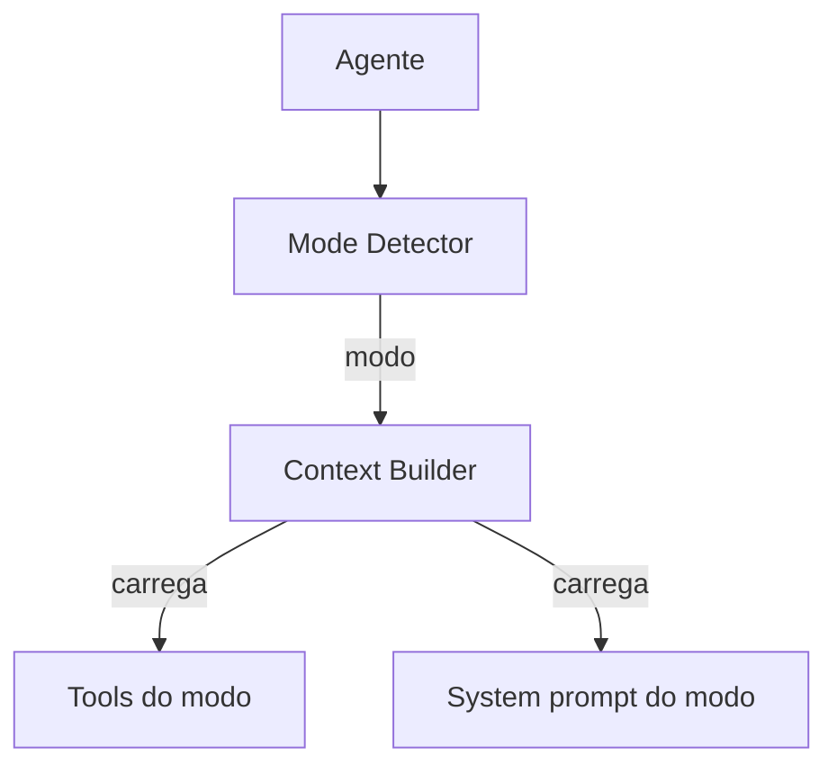

# Roo-Code — Gerenciamento de Contexto

## Arquitetura

O Roo-Code usa mode-based context:

## Componentes

| Componente | Local | Responsabilidade |
|------------|-------|------------------|
| Mode Detector | `src/modes/` | Detecta modo |
| Context Builder | `src/context/` | Monta contexto por modo |

## Mode-based Context

Cada modo tem seu próprio contexto:
- Code: tools de código + system prompt de código
- Architect: tools de planejamento + system prompt de arquiteto
- Debug: tools de debug + system prompt de debugger

## Pontos Fortes

1. Contexto especializado por modo
2. Tools relevantes por contexto

## Limitações

1. Descontinuado
2. Sem RAG
3. Sem compaction

## Oportunidades para o XForge

1. Mode-based context = skills context