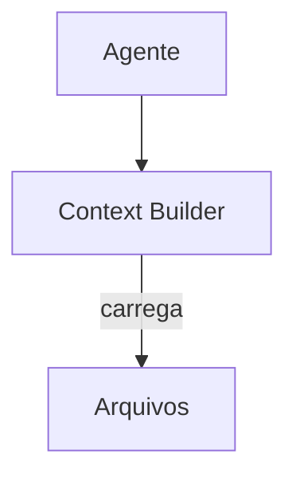

# Twinny — Gerenciamento de Contexto

## Arquitetura

O Twinny tem contexto mínimo:

## Componentes

| Componente | Responsabilidade |
|------------|------------------|
| Context Builder | Monta contexto básico |

## Funcionalidades

1. Local-first (Ollama)
2. Contexto mínimo
3. Privacidade

## Pontos Fortes

1. Privacidade
2. Simplicidade

## Limitações

1. Sem tools avançadas
2. Sem RAG
3. Sem compaction

## Oportunidades para o XForge

1. Local-first + RAG híbrido