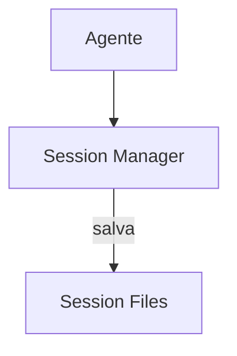

# Aider — Sistema de Memória

## Arquitetura

O Aider usa sessões para persistência:

## Pontos Fortes

1. Sessões persistentes
2. Git-native

## Limitações

1. Sem error learning
2. Sem compaction

## Oportunidades para o XForge

1. Sessões + error graph