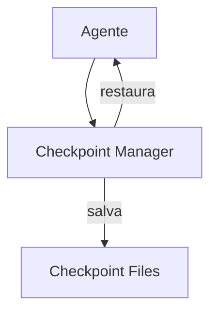

# Cline — Sistema de Memória

## Arquitetura

O Cline usa checkpoints para persistência:

## Componentes

| Componente | Arquivo | Responsabilidade |
|------------|---------|------------------|
| CheckpointManager | `src/services/checkpoint.ts` | Save/restore |
| History Store | `src/history/` | Histórico |

## Checkpoint System

O Cline salva checkpoints completos:
- Estado da conversação
- Arquivos modificados
- Próximos passos
- Decisões tomadas

## .clinerules

O Cline usa `.clinerules` para regras:
- Coding standards
- Project conventions
- Build instructions

## Pontos Fortes

1. Checkpoint completo
2. .clinerules por projeto
3. Multi-session persistence

## Limitações

1. Sem compactação
2. Sem error learning
3. Sem knowledge graph

## Oportunidades para o XForge

1. Checkpoint + error learning
2. .clinerules como modelo para per-directory