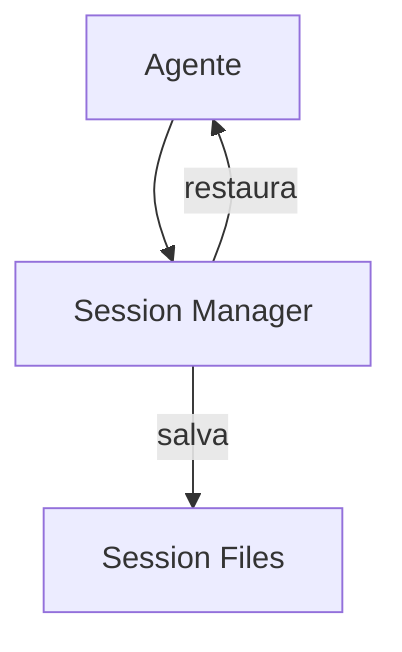

# Continue — Sistema de Memória

## Arquitetura

O Continue usa sessões para persistência:

## Componentes

| Componente | Package | Responsabilidade |
|------------|---------|------------------|
| Session Manager | core | Gerencia sessões |
| History Store | core | Histórico |

## Session History

O Continue salva histórico de conversas:
- Mensagens
- Respostas
- Contexto usado

## Pontos Fortes

1. Session history
2. Multi-IDE sync

## Limitações

1. Read-only (não mantido)
2. Sem error learning
3. Sem knowledge graph

## Oportunidades para o XForge

1. Session history + error learning