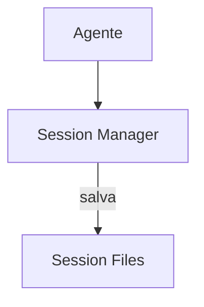

# Goose — Sistema de Memória

## Arquitetura

O Goose usa sessões para persistência:

## Componentes

| Componente | Crate | Responsabilidade |
|------------|-------|------------------|
| Session Manager | goose-server | Gerencia sessões |

## Pontos Fortes

1. Sessões persistentes
2. Multi-plataforma

## Limitações

1. Sem error learning
2. Sem knowledge graph
3. Sem compaction

## Oportunidades para o XForge

1. Sessões + error graph