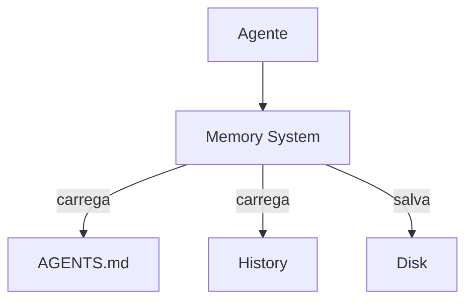

# Kilo Code — Sistema de Memória

## Arquitetura

O Kilo Code usa AGENTS.md para persistência:

## Componentes

| Componente | Arquivo | Responsabilidade |
|------------|---------|------------------|
| Memory Manager | opencode | Gerencia memória |
| History Store | opencode | Histórico de sessões |
| Rules Loader | opencode | Carrega AGENTS.md |

## AGENTS.md

O Kilo Code usa AGENTS.md para regras persistentes:
- Coding standards
- Project conventions
- Build instructions
- Test instructions

## Session History

O histórico é salvo por projeto:
- `.xforge/memory/sessions/`
- Histórico de decisões
- Arquivos modificados

## Pontos Fortes

1. AGENTS.md persistente
2. Session history por projeto

## Limitações

1. Sem memory namespace isolation
2. Sem error learning
3. Sem knowledge graph
4. Sem TTL em conhecimento

## Oportunidades para o XForge

1. Memory namespace isolation
2. Error graph entre sessões
3. Knowledge graph com TTL