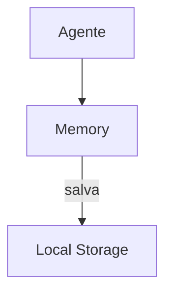

# MiMo-Code — Sistema de Memória

## Arquitetura

O MiMo-Code tem memória mínima:

```mermaid
flowchart TD
    AG[Agente] --> MEM[Memory]
    MEM -->|salva| DISK[Local Storage]
```

## Limitações

1. Funcionalidades limitadas