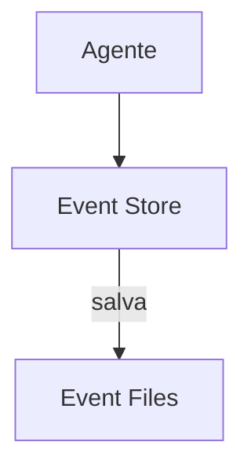

# OpenHands — Sistema de Memória

## Arquitetura

O OpenHands usa eventos para persistência:

## Pontos Fortes

1. Event sourcing
2. Audit trail

## Limitações

1. Sem error learning
2. Sem compaction

## Oportunidades para o XForge

1. Event sourcing + error graph