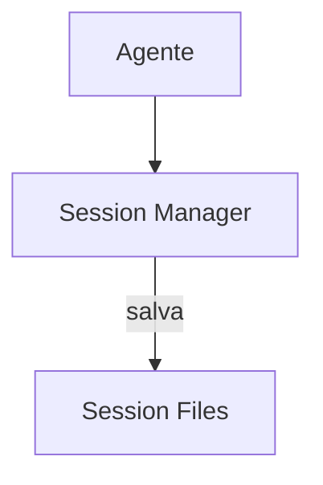

# Roo-Code — Sistema de Memória

## Arquitetura

O Roo-Code usa sessões para persistência:

## Pontos Fortes

1. Sessões por modo

## Limitações

1. Descontinuado
2. Sem error learning

## Oportunidades para o XForge

1. Sessões + mode-based memory