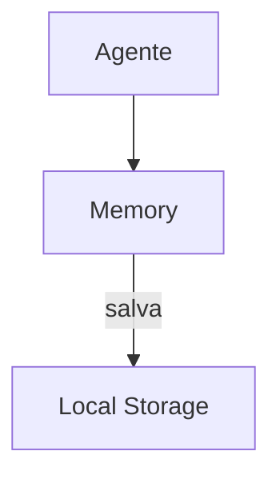

# Twinny — Sistema de Memória

## Arquitetura

O Twinny tem memória mínima:

## Pontos Fortes

1. Local-first
2. Privacidade

## Limitações

1. Sem error learning
2. Sem compaction

## Oportunidades para o XForge

1. Local memory + error graph