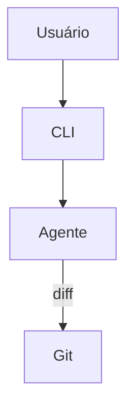

# Aider — Sistema de Agentes

## Arquitetura

O Aider tem um agente único:

## Componentes

| Componente | Arquivo | Responsabilidade |
|------------|---------|------------------|
| Agent | `aider/main.py` | Agente principal |
| RepoMap | `aider/repomap.py` | Mapeamento |

## Funcionalidades

1. Git-native editing
2. Pair programming
3. Auto-commit

## Pontos Fortes

1. Git-native
2. Minimalista

## Limitações

1. Sem multi-agentes
2. Sem modos
3. Sem Genius Council

## Oportunidades para o XForge

1. Git-native + multi-agentes