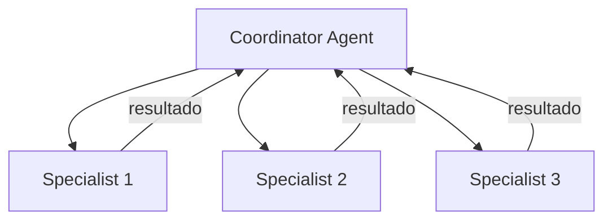

# Cline — Sistema de Agentes

## Arquitetura

O Cline tem multi-agent teams:

## Componentes

| Componente | Arquivo | Responsabilidade |
|------------|---------|------------------|
| Coordinator | `src/core/agent-loop.ts` | Coordena equipe |
| Specialist | `src/core/agent.ts` | Executa subtarefa |
| Team Manager | `src/services/team.ts` | Gerencia equipe |

## Multi-Agent Teams

O Cline permite coordenar múltiplos agentes:
- Coordinator divide trabalho em subtarefas
- Specialists executam paralelo
- Estado persiste entre sessões

## Scheduled Agents

O Cline suporta agentes agendados:
- Cron jobs para automação
- Daily PR summaries
- Weekly dependency checks

## Pontos Fortes

1. Multi-agent teams
2. Scheduled agents
3. Estado persistente entre sessões

## Limitações

1. Sem Router + Worker
2. Sem Genius Council
3. Sem error learning

## Oportunidades para o XForge

1. Multi-agent + Router + Worker
2. Scheduled agents + error graph