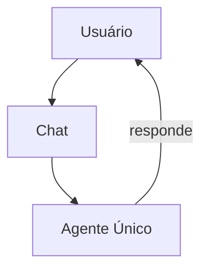

# Continue — Sistema de Agentes

## Arquitetura

O Continue não tem sistema de agentes — é um chat/autocomplete:

## Componentes

| Componente | Package | Responsabilidade |
|------------|---------|------------------|
| Agent | core | Processa prompts |

## Funcionalidades

1. Chat com contexto
2. Inline autocomplete
3. Code editing

## Pontos Fortes

1. Simplicidade
2. Autocomplete inteligente

## Limitações

1. Sem multi-agentes
2. Sem modos especializados
3. Sem Genius Council

## Oportunidades para o XForge

1. Adicionar modos especializados
2. Implementar multi-agentes