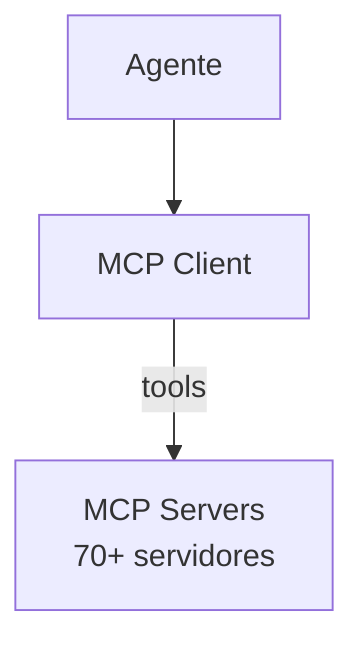

# Goose — Sistema de Agentes

## Arquitetura

O Goose tem um agente com MCP tools:

## Componentes

| Componente | Crate | Responsabilidade |
|------------|-------|------------------|
| Agent | goose | Agente principal |
| MCP Client | goose-mcp | Conecta a servidores |

## Funcionalidades

1. Desktop + CLI + API
2. MCP tools dinâmicas
3. Multi-provider

## Pontos Fortes

1. MCP-first
2. Multi-plataforma

## Limitações

1. Sem multi-agentes
2. Sem modos especializados
3. Sem Genius Council

## Oportunidades para o XForge

1. MCP + multi-agentes