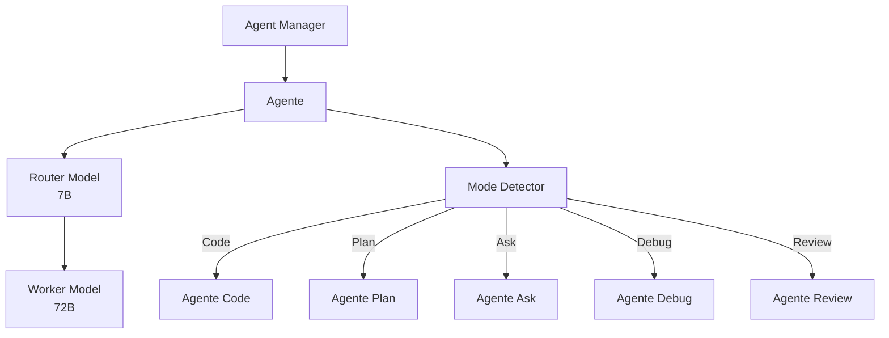

# Kilo Code — Sistema de Agentes

## Arquitetura

O Kilo Code tem o sistema de agentes mais avançado entre os projetos analisados:

## Componentes

| Componente | Package | Responsabilidade |
|------------|---------|------------------|
| Agent Manager | kilo-vscode | Orquestração multi-sessão |
| Router | llm | Modelo leve para decisões |
| Worker | llm | Modelo pesado para execução |
| Mode Detector | opencode | Detecta modo do prompt |

## Agentes Especializados

| Agente | System Prompt | Tools |
|--------|---------------|-------|
| Code | Expert developer | read, write, edit, bash |
| Plan | Architect + Planner | plan, search, write |
| Ask | Code reviewer | search, read |
| Debug | Debugger + Tracer | read, bash, debug |
| Review | Security + Quality | read, search, analyze |

## Agent Manager

O Agent Manager é único:
- Multi-sessão simultânea
- Git worktree isolation por sessão
- Estado compartilhado entre sessões do mesmo projeto
- Interface de gerenciamento no sidebar

## Router + Worker

O Kilo Code usa split architecture:
- Router (7B): decide próxima ação (< 2s)
- Worker (72B): executa tarefa (10-30s)
- Fallback: 7B → 14B → 72B

## Pontos Fortes

1. 5 agentes especializados
2. Agent Manager com worktree isolation
3. Router + Worker reduz custo em 70%

## Limitações

1. Sem error learning entre sessões
2. Sem memory namespace isolation

## Oportunidades para o XForge

1. Adicionar Genius Council
2. Implementar error graph
3. Melhorar mode detection com LLM