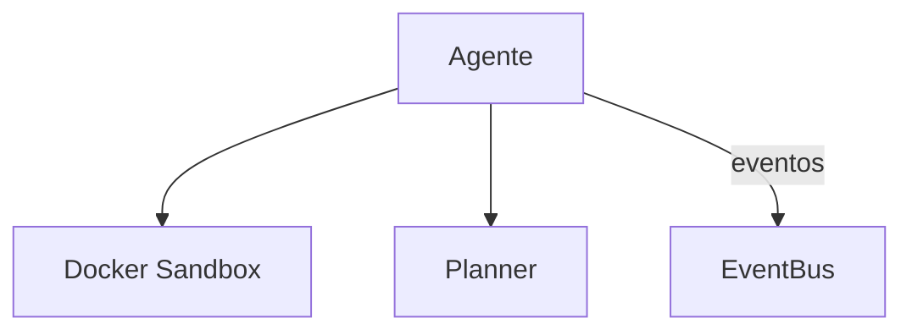

# OpenHands — Sistema de Agentes

## Arquitetura

O OpenHands tem multi-agente com sandbox:

## Componentes

| Componente | Local | Responsabilidade |
|------------|-------|------------------|
| Agent | `openhands/agent/` | Agente principal |
| Planner | `openhands/agent/` | Planejador |
| EventBus | `openhands/events/` | Eventos |

## Funcionalidades

1. Multi-agente
2. Sandbox Docker
3. Event-driven
4. Planner integrado

## Pontos Fortes

1. Sandbox seguro
2. Event-driven escalável

## Limitações

1. Latência do sandbox
2. Sem Genius Council

## Oportunidades para o XForge

1. Sandbox + Genius Council