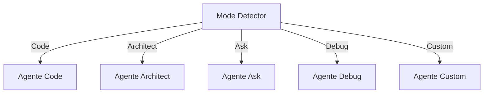

# Roo-Code — Sistema de Agentes

## Arquitetura

O Roo-Code tem sistema de modos:

## Componentes

| Componente | Local | Responsabilidade |
|------------|-------|------------------|
| Mode Detector | `src/modes/` | Detecta modo |
| AgentFactory | `src/modes/` | Cria agente |

## Modos

| Modo | System Prompt | Tools |
|------|---------------|-------|
| Code | Expert developer | read, write, edit, bash |
| Architect | System architect | plan, search, write |
| Ask | Code reviewer | search, read |
| Debug | Debugger | read, bash, debug |
| Custom | User-defined | Customizáveis |

## Pontos Fortes

1. Sistema de modos único
2. Tools especializadas por modo
3. Custom modes

## Limitações

1. Descontinuado
2. Sem multi-agentes
3. Sem Genius Council

## Oportunidades para o XForge

1. Modos + Genius Council
2. Custom modes + skills