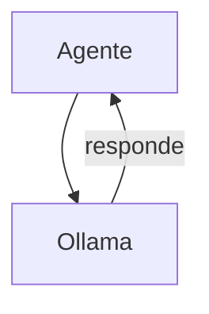

# Twinny — Sistema de Agentes

## Arquitetura

O Twinny tem um agente único:

```mermaid
flowchart TD
    AG[Agente] --> OLL[Ollama]
    OLL -->|responde| AG
```

## Funcionalidades

1. Local-first (Ollama)
2. Chat básico

## Limitações

1. Sem multi-agentes
2. Sem modos