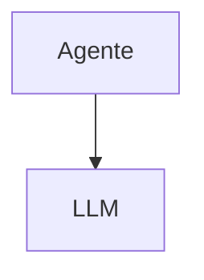

# Aider — Integração MCP

## Arquitetura

O Aider não suporta MCP:

```mermaid
flowchart TD
    AG[Agente] --> LLM[LLM]
```

## Limitações

1. Sem MCP
2. Sem ferramentas externas

## Oportunidades para o XForge

1. Adicionar suporte a MCP