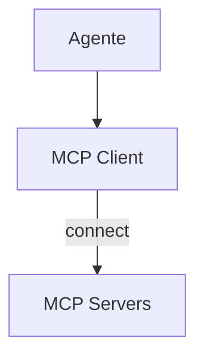

# Cline — Integração MCP

## Arquitetura

O Cline suporta servidores MCP:

## Componentes

| Componente | Arquivo | Responsabilidade |
|------------|---------|------------------|
| MCPClient | `src/services/mcp.ts` | Conecta a servidores |
| MCPManager | `src/services/mcp.ts` | Gerencia servidores |

## Funcionalidades

1. Servidores MCP externos
2. Tool discovery
3. Configuração manual

## Pontos Fortes

1. Suporte a MCP
2. Tool discovery

## Limitações

1. Configuração manual
2. Sem marketplace
3. Sem sandbox

## Oportunidades para o XForge

1. MCP marketplace
2. Auto-discovery