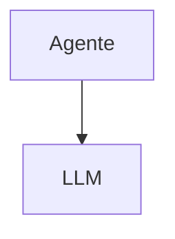

# Continue — Integração MCP

## Arquitetura

O Continue não suporta MCP nativamente:

## Funcionalidades

1. Sem MCP
2. RAG local como alternativa

## Limitações

1. Sem MCP
2. Sem ferramentas externas

## Oportunidades para o XForge

1. Adicionar suporte a MCP