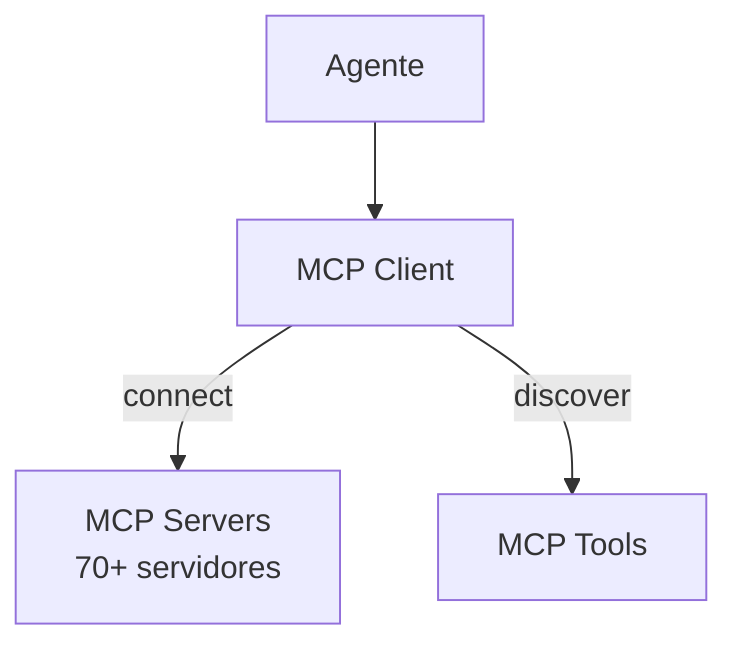

# Goose — Integração MCP

## Arquitetura

O Goose é MCP-first:

## Componentes

| Componente | Crate | Responsabilidade |
|------------|-------|------------------|
| MCP Client | goose-mcp | Conecta a servidores |
| MCP Manager | goose-mcp | Gerencia servidores |

## Servidores MCP

O Goose suporta 70+ servidores MCP:
- GitHub
- Database
- Browser
- Filesystem
- Custom servers

## Funcionalidades

1. 70+ servidores MCP
2. Tool discovery automático
3. Sandbox para execução

## Pontos Fortes

1. MCP-first architecture
2. 70+ extensões
3. Tool discovery automático

## Limitações

1. Sem marketplace
2. Sem per-tool permissions

## Oportunidades para o XForge

1. 70+ servidores + marketplace
2. Per-tool permissions + sandbox