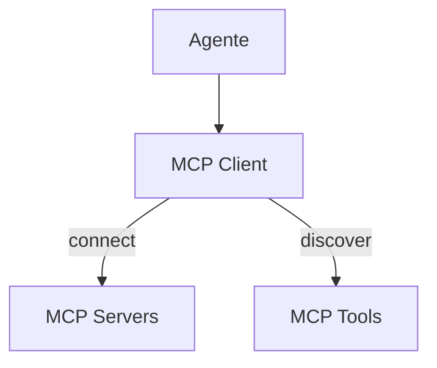

# Kilo Code — Integração MCP

## Arquitetura

O Kilo Code tem MCP marketplace:

## Componentes

| Componente | Package | Responsabilidade |
|------------|---------|------------------|
| MCP Client | plugin | Conecta a servidores |
| MCP Manager | plugin | Gerencia servidores |
| MCP Marketplace | kilo-vscode | Marketplace de servidores |

## Servidores MCP

O Kilo Code suporta servidores MCP via marketplace:
- GitHub MCP
- Database MCP
- Browser MCP
- Custom servers

## Funcionalidades

1. MCP marketplace
2. Tool discovery automático
3. Configuração por projeto

## Pontos Fortes

1. Marketplace integrado
2. Tool discovery automático

## Limitações

1. Sem sandbox para MCP tools
2. Sem per-tool permissions

## Oportunidades para o XForge

1. MCP marketplace + sandbox
2. Per-tool permissions