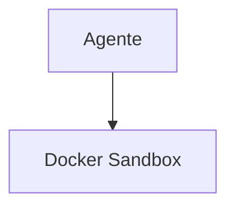

# OpenHands — Integração MCP

## Arquitetura

O OpenHands não suporta MCP:

```mermaid
flowchart TD
    AG[Agente] --> SANDBOX[Docker Sandbox]
```

## Limitações

1. Sem MCP
2. Sandbox como alternativa

## Oportunidades para o XForge

1. Adicionar suporte a MCP