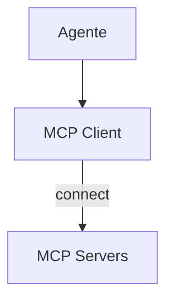

# Roo-Code — Integração MCP

## Arquitetura

O Roo-Code suporta MCP:

## Componentes

| Componente | Local | Responsabilidade |
|------------|-------|------------------|
| MCP Client | `src/mcp/` | Conecta a servidores |

## Funcionalidades

1. Servidores MCP
2. Tool discovery

## Pontos Fortes

1. Suporte a MCP

## Limitações

1. Descontinuado
2. Sem marketplace

## Oportunidades para o XForge

1. MCP + marketplace