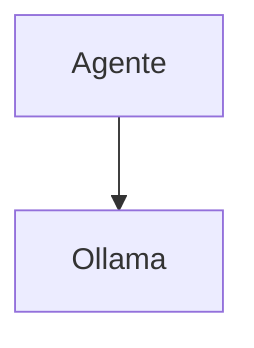

# Twinny — Integração MCP

## Arquitetura

O Twinny não suporta MCP:

```mermaid
flowchart TD
    AG[Agente] --> OLL[Ollama]
```

## Limitações

1. Sem MCP
2. Sem ferramentas externas

## Oportunidades para o XForge

1. Adicionar suporte a MCP