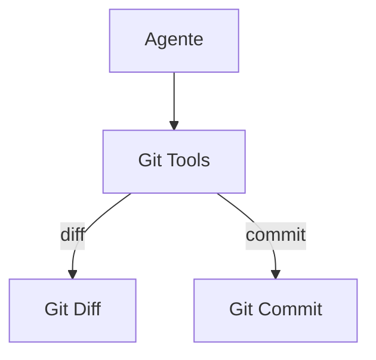

# Aider — Sistema de Ferramentas

## Arquitetura

O Aider tem ferramentas git:

## Git Tools

| Tool | Arquivo | Descrição |
|------|---------|-----------|
| git_diff | `aider/utils.py` | Gera diffs |
| git_commit | `aider/main.py` | Commits automáticos |
| git_log | `aider/utils.py` | Log de commits |

## Pontos Fortes

1. Git-native tools
2. Auto-commit

## Limitações

1. Sem MCP tools
2. Sem bash tool

## Oportunidades para o XForge

1. Git tools + MCP