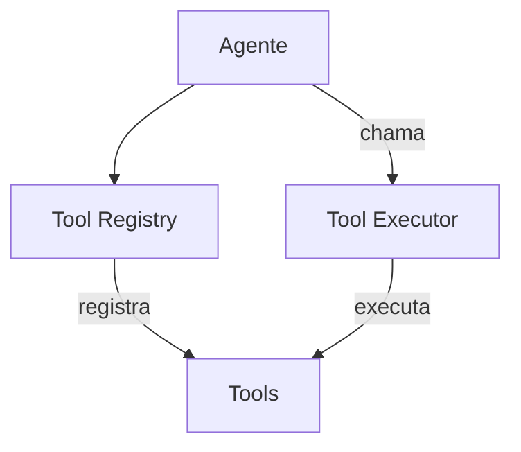

# Cline — Sistema de Ferramentas

## Arquitetura

O Cline tem ferramentas built-in e browser:

## Built-in Tools

| Tool | Arquivo | Descrição |
|------|---------|-----------|
| read_file | `src/core/tools.ts` | Lê conteúdo de arquivo |
| write_file | `src/core/tools.ts` | Escreve arquivo novo |
| edit_file | `src/core/tools.ts` | Edita arquivo existente |
| bash | `src/core/tools.ts` | Executa comando terminal |
| browser | `src/core/tools.ts` | Automação de navegador |
| search | `src/core/tools.ts` | Busca no código |

## Browser Automation

O Cline tem browser automation único:
- Playwright integrado
- Web scraping
- Form filling
- Screenshot

## Pontos Fortes

1. Browser automation
2. Tools bem definidas

## Limitações

1. Sem self-healing
2. Sem MCP tools

## Oportunidades para o XForge

1. Browser automation + self-healing