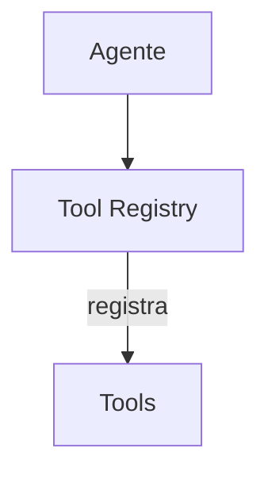

# Continue — Sistema de Ferramentas

## Arquitetura

O Continue tem ferramentas via core:

## Built-in Tools

| Tool | Package | Descrição |
|------|---------|-----------|
| read_file | core | Lê conteúdo de arquivo |
| write_file | core | Escreve arquivo novo |
| edit_file | core | Edita arquivo existente |
| search | core | Busca no código |

## Autocomplete Tool

O Continue tem autocomplete único:
- Ghost-text suggestions
- Tab para aceitar
- Context-aware

## Pontos Fortes

1. Autocomplete inteligente

## Limitações

1. Sem bash tool
2. Sem browser tool

## Oportunidades para o XForge

1. Autocomplete + bash + browser