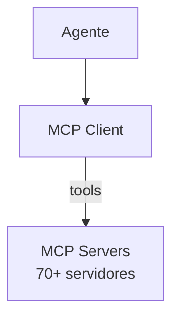

# Goose — Sistema de Ferramentas

## Arquitetura

O Goose usa MCP para ferramentas:

## MCP Tools

O Goose tem ferramentas via MCP:
- GitHub tools
- Database tools
- Browser tools
- Filesystem tools
- Custom tools

## Funcionalidades

1. 70+ ferramentas MCP
2. Tool discovery automático
3. Sandbox para execução

## Pontos Fortes

1. MCP-first tools
2. 70+ extensões

## Limitações

1. Sem built-in tools
2. Depende de MCP

## Oportunidades para o XForge

1. Built-in + MCP tools