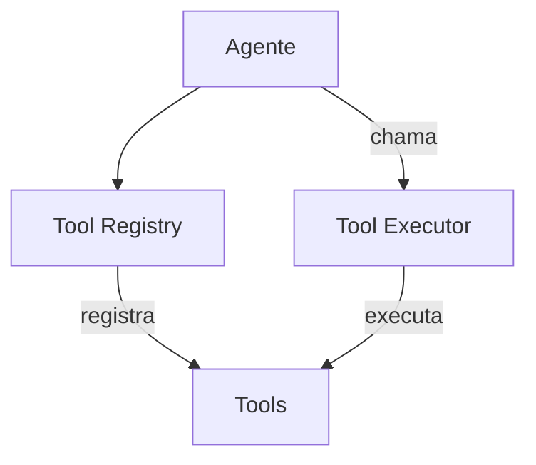

# Kilo Code — Sistema de Ferramentas

## Arquitetura

O Kilo Code tem um sistema de ferramentas completo:

## Built-in Tools

| Tool | Arquivo | Descrição |
|------|---------|-----------|
| read_file | `packages/opencode/src/tools/` | Lê conteúdo de arquivo |
| write_file | `packages/opencode/src/tools/` | Escreve arquivo novo |
| edit_file | `packages/opencode/src/tools/` | Edita arquivo existente |
| bash | `packages/opencode/src/tools/` | Executa comando terminal |
| search | `packages/opencode/src/tools/` | Busca no código |
| list_files | `packages/opencode/src/tools/` | Lista arquivos |

## MCP Tools

O Kilo Code suporta ferramentas via MCP:
- GitHub tools
- Database tools
- Browser tools
- Custom tools

## Self-Checking

O agente revisa seu próprio trabalho:
- Verifica erros de compilação
- Verifica imports faltando
- Verifica tipos
- Corrige automaticamente

## Pontos Fortes

1. Tools bem definidas
2. Self-checking integrado
3. MCP tools

## Limitações

1. Sem self-healing automático
2. Sem error learning

## Oportunidades para o XForge

1. Adicionar self-healing (SH-001 a SH-012)
2. Implementar error graph