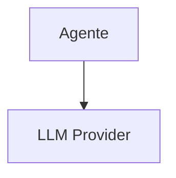

# MiMo-Code — Sistema de Ferramentas

## Arquitetura

O MiMo-Code tem ferramentas mínimas:

```mermaid
flowchart TD
    AG[Agente] --> LLM[LLM Provider]
```

## Limitações

1. Funcionalidades limitadas