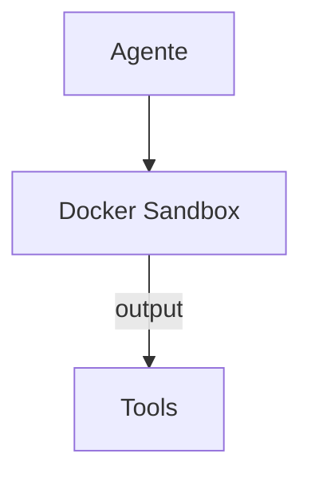

# OpenHands — Sistema de Ferramentas

## Arquitetura

O OpenHands usa sandbox para ferramentas:

## Sandbox Tools

| Tool | Descrição |
|------|-----------|
| bash | Execução de comandos |
| read | Leitura de arquivos |
| write | Escrita de arquivos |

## Pontos Fortes

1. Sandbox seguro

## Limitações

1. Latência do sandbox
2. Sem MCP tools

## Oportunidades para o XForge

1. Sandbox + MCP tools